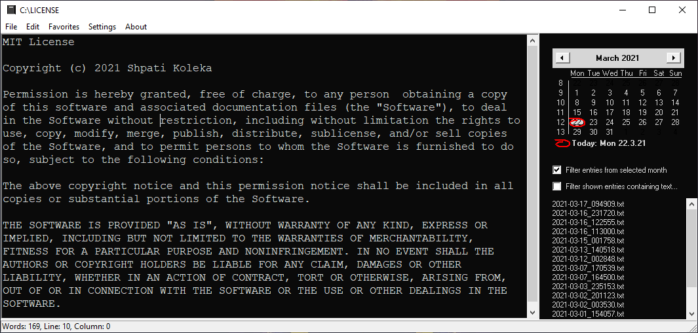

# Journalista
Journalista is a handy program for keeping journals, diary entries, or other text notes. 

Some of the program features are:

-	Simple and distraction-free text editor. No unnecessary bells and whistles, so you can focus on your writing instead. 
-	Creates simple text files (ANSI) that can be opened with any other text editor. 
-	Small program in size, about 0.6 MB. Needs no additional libraries, runtime components, .net framework, etc.  
-	Runs fast on any 32/64 bit Windows machine, i.e. Windows 95/98/NT/2000/XP/7/8/10. 
-	The new entries are created using the current timestamp as the default filename. Useful for journaling and quick notes.
-	Encryption functionality is available for added privacy. This feature keeps your notes private, just make sure you do not forget your password!
-	Embedded file viewer in the program, quickly displays the contents of the 'entries' folder.  
-	Filtering of entries by month using the calendar inside the program. 
-	Filtering of entries by checking if a user-defined text string is found in them. Useful if you insert tags/hashtags in the bottom of your journal entries. 
-	Possibility of adding files to favorites, just like bookmarks in a browser.
-	Convertion from UTF-8 format to ANSI. This is useful for opening text files created by other programs in UTF-8 format.
-	The color theme can be customized to better match the user preferences. 
-	The location of the entries folder can be freely selected by the user. PRO TIP: Consider selecting the 'entries' folder inside your cloud storage folder (if you use one) so that you can access the journal entries from any device.
-	It's a free program (MIT license) so you can do whatever you want with the code. 
